# File Search Agent 開発

## 1. プロジェクト概要

### 背景・動機
Deploy-Agent（FastMCP × AWS Bedrock × LlamaIndex）の開発記事を参考に、同じ技術スタックを応用して個人用ファイル検索ツールを開発する。

特にエクスプローラーについて「あのファイルどこだっけ」という状況を解消するため、ファイル名だけではなく**内容・文脈で検索できる仕組み**を構築する。

参考記事：[[Deploy-Agent開発 Vol.1] FastMCP × AWS Bedrockで「コードとドキュメントを読んで勝手にデプロイ計画を立てるAI」を作ってみた](https://qiita.com/kz-ow/items/ec9d115421e5a3da9076)

### やりたいこと
自分のPC内のファイルを自然言語で検索できるツールを作る。

**注意：**
PDFなどの大容量ファイルはインデックス化に時間がかかるため、現在は比較的容量が小さいテキストベースのファイルを対象としている。対象ファイルの詳細は要件定義を参照。

## 2. 要件定義

### 機能要件
- 自然言語でPC内のファイルを検索可能
- ファイル名だけでなく、**内容・文脈**で検索可能
- ファイルの追加・変更・削除を自動検知してインデックスを更新する
- Claude for Desktopのチャットから検索できる

### 非機能要件
- ベクトルとインデックスはローカルに保存
- GPU不要でノートPCで動作する

### 対象ファイル
- コードファイル（.py, .ts, .js など）
- テキスト・Markdown（.txt, .md）
- 設定ファイル（.json, .yaml など）
- （※PDFなどは大容量のため今回は除外）

### 除外ファイル
- 画像・動画・音声
- 圧縮ファイル・バイナリ
- 依存関係フォルダ（node_modules, venv など）
- Gitの内部ファイル
- 非公開情報（.env）

---

## 3. システム設計

### アーキテクチャ

```mermaid
graph TB
    subgraph PC["あなたのPC"]
        A[Claude for Desktop<br/>UI]
        B[MCP Server FastMCP<br/>検索ツールを公開]
        C[検索エンジン LlamaIndex<br/>クエリをベクトル化]
        D[FAISS Index<br/>ベクトルをローカル保存]
        E[対象ファイル PC内<br/>コード・テキスト・設定ファイル]
        
        A <-->|MCP Protocol| B
        B --> C
        C <--> D
        E -->|初回インデックス化| D
    end
    
    subgraph AWS["AWS Bedrock"]
        F[Titan Embed v2<br/>テキストをベクトル化]
        G[Claude 3.5 Sonnet<br/>回答を自然言語で生成]
        H[CDKでIAM管理]
    end
    
    C <-->|AWS SDK boto3| F
    C <-->|AWS SDK boto3| G
    
    style A fill:#4b378b
    style B fill:#185e43
    style C fill:#185e43
    style D fill:#8a571c
    style E fill:#333
    style F fill:#173b6c
    style G fill:#173b6c
    style H fill:#173b6c
```



あなたのPC
┌─────────────────────────────────────────┐
│                                         │
│  Claude for Desktop                     │
│       ↕ MCP Protocol                   │
│  MCP Server (FastMCP) [server.py]       │
│       ↕                                 │
│  検索エンジン [searcher.py]              │
│       ↕                                 │
│  インデクサー [indexer.py]               │
│       ↕                                 │
│  FAISSインデックス（ローカル保存）        │
│                                         │
└─────────────────────────────────────────┘
         ↕ AWS SDK (boto3)
┌─────────────────────────────────────────┐
│  AWS Bedrock (ap-northeast-1)           │
│  ・Titan Embed Text v2（ベクトル化）     │
│  ・Claude Sonnet 4.6 JP推論プロファイル  │
│    （回答生成）                          │
└─────────────────────────────────────────┘

### 技術スタック

| 役割 | 技術 |
|------|------|
| UIフレームワーク | FastMCP |
| RAGフレームワーク | LlamaIndex |
| Embedding | Amazon Titan Embed Text v2 |
| LLM | Claude Sonnet 4.6（JP推論プロファイル） |
| ベクトルDB | FAISS（ローカル保存） |
| ファイル監視 | watchdog |
| インフラ管理 | AWS CDK（TypeScript） |
| 言語 | Python 3.13 |

### データフロー

**インデックス化（初回・差分更新）**
```
PC内ファイル
→ ハッシュ値で差分検出
→ SimpleDirectoryReader でテキスト抽出
→ Titan Embed Text v2 でベクトル化（Bedrock API）
→ FAISS インデックスにローカル保存
→ メタデータ（ハッシュ・更新日時）を JSON で管理
```

**検索時**
```
ユーザーのクエリ（自然言語）
→ Titan Embed Text v2 でベクトル化
→ FAISS で類似チャンク上位5件を取得
→ Claude Sonnet 4.6 が自然言語で回答生成
→ 参照ファイルパスと合わせて返答
```

### プロジェクト構成

```
file-search-agent/
├── cdk/                        # AWS CDK（インフラ管理）
│   ├── bin/
│   │   └── cdk.ts              # CDKエントリーポイント
│   ├── lib/
│   │   └── file-search-stack.ts # IAMリソース定義
│   └── package.json
├── mcp-server/                 # アプリケーション本体
│   ├── server.py               # Phase 4: FastMCP MCPサーバー
│   ├── indexer.py              # Phase 2: インデクサー
│   ├── searcher.py             # Phase 3: 検索エンジン
│   ├── requirements.txt
│   ├── .env                    # 認証情報・設定
│   └── data/
│       ├── index/              # FAISSインデックス（自動生成）
│       └── index_meta.json     # 差分更新用メタデータ
└── venv/                       # Python仮想環境
```

---

## 4. 環境構築

### 前提条件
- Python 3.13
- Node.js（CDK用）
- AWS CLI
- AWS CDK CLI（`npm install -g aws-cdk`）

### Python環境のセットアップ

```powershell
# 仮想環境の作成
cd file-search-agent
python -m venv venv
.\venv\Scripts\Activate.ps1

# ライブラリのインストール
pip install -r mcp-server/requirements.txt
```

### requirements.txt

```
llama-index
llama-index-embeddings-bedrock
llama-index-llms-bedrock
llama-index-llms-bedrock-converse
boto3
faiss-cpu
watchdog
python-dotenv
fastmcp
```

### AWS認証設定

```powershell
aws configure
# AWS Access Key ID: （natorihirofumi_cli のキー）
# AWS Secret Access Key: （シークレットキー）
# Default region name: ap-northeast-1
# Default output format: json
```

### .env の設定

```env
AWS_ACCESS_KEY_ID=（natorihirofumi_cli のアクセスキー）
AWS_SECRET_ACCESS_KEY=（シークレットキー）
AWS_DEFAULT_REGION=ap-northeast-1

TARGET_DIRS=C:/Users/nh200/Cloude_Application_Development/file-search-agent/cdk,C:/Users/nh200/Cloude_Application_Development/file-search-agent/mcp-server
INDEX_DIR=./data/index
META_FILE=./data/index_meta.json
WATCH_ENABLED=true
EMBED_MODEL=amazon.titan-embed-text-v2:0
LLM_MODEL=jp.anthropic.claude-sonnet-4-6
```

---

## 5. AWSインフラ構築（Phase 1） ✅

### CDKでIAMリソースをデプロイ

```powershell
cd cdk
npm install
cdk bootstrap   # 初回のみ
cdk deploy
```

### 作成されるリソース

| リソース | 説明 |
|---------|------|
| IAM User: `file-search-bedrock-user` | Bedrock呼び出し用ユーザー |
| IAM Policy: `FileSearchBedrockPolicy` | Bedrock権限ポリシー |
| IAM Access Key | .envに設定するキー |

> **注意**: 現在は開発中のため`natorihirofumi_cli`（AdministratorAccess）のキーを使用。完成後に`file-search-bedrock-user`のキーに切り替える予定。

### 許可しているBedrockリソース

```
# Embedding
arn:aws:bedrock:ap-northeast-1::foundation-model/amazon.titan-embed-text-v2:0

# LLM（JP推論プロファイル）
arn:aws:bedrock:ap-northeast-1:716287580111:inference-profile/jp.anthropic.claude-sonnet-4-6
```

---

## 6. インデクサー実装（Phase 2） ✅

### 主要機能

**差分更新**
- ファイルのMD5ハッシュ値を`index_meta.json`で管理
- 前回インデックス化以降に変更・追加されたファイルのみ再処理
- 削除されたファイルはインデックスから除外

**watchdog自動監視**
- ファイルの追加・変更・削除・移動を検知
- デバウンス処理（3秒）で連続イベントをまとめて1回の更新に

**ノイズ除外**
- 画像・動画・音声・バイナリを除外
- node_modules・venv・.gitなどを除外
- .env・data/フォルダ自身も除外（無限ループ防止）

**注意点**
- printは全てstderrに出力する（MCPのstdio通信を汚染しないため）
- 絵文字はWindowsのcp932エンコーディングでクラッシュするため使用禁止

### 実行方法

```powershell
cd mcp-server

# 差分更新を1回実行
python indexer.py

# 差分更新後、watchdogで常駐監視
python indexer.py --watch
```

---

## 7. 検索エンジン実装（Phase 3） ✅

### 主要機能
- FAISSインデックスからクエリに類似する上位5件のチャンクを取得
- Claude Sonnet 4.6が自然言語で回答を生成
- 参照したファイルのパスも合わせて返す

### LlamaIndexとboto3の使い分け

LlamaIndexの`BedrockConverse`クラスはJP推論プロファイル（`jp.`プレフィックス）に対応していないため、`CustomLLM`を継承してboto3で直接Converse APIを呼び出すカスタムLLMを実装。

### 実行方法

```powershell
python searcher.py "IAMロールはどこで定義されている？"
python searcher.py "watchdogはどんな処理をしている？"
```

---

## 8. MCPサーバー実装（Phase 4） ✅

### 公開しているMCPツール

| ツール名 | 説明 |
|---------|------|
| `search_files` | 自然言語でPC内ファイルを検索（デフォルトまたは指定ディレクトリ） |
| `reindex_files` | インデックスを手動更新 |
| `index_status` | インデックス状態を確認 |

### search_filesの使い方

**1. デフォルトディレクトリから検索**
```
エクスプローラーについて IAMロールの定義を探して
```

**2. 特定のディレクトリを指定して検索**
```
エクスプローラーについて "C:/Users/Documents" の中からPythonコードを検索
```

**3. 複数ディレクトリを指定**
```
エクスプローラーについて "C:/Projects,C:/Documents" から機械学習のファイルを探して
```

**重要な注意点：**
- 必ず「エクスプローラーについて」というキーワードを付けてください
- ダブルクォート `"パス"` で囲むと、そのディレクトリ専用の一時インデックスが作成されます
- パスを指定しない場合は、.envの`TARGET_DIRS`が使用されます

### 起動時の動作
1. インデックス読み込み
2. 差分更新を1回実行（バックグラウンドで実行、タイムアウト防止）
3. watchdogがバックグラウンドで常時監視開始
4. ファイル変更を検知したら自動でインデックス更新（デバウンス3秒）

---

## 9. Claude for Desktop連携（Phase 5） ✅

### 設定ファイルの場所

```
C:\Users\nh200\AppData\Local\Packages\Claude_pzs8sxrjxfjjc\LocalCache\Roaming\Claude\claude_desktop_config.json
```

### 設定内容

```json
{
  "mcpServers": {
    "file-search-agent": {
      "command": "C:\\Users\\nh200\\Cloude_Application_Development\\file-search-agent\\venv\\Scripts\\python.exe",
      "args": [
        "C:\\Users\\nh200\\Cloude_Application_Development\\file-search-agent\\mcp-server\\server.py"
      ],
      "env": {
        "AWS_ACCESS_KEY_ID": "...",
        "AWS_SECRET_ACCESS_KEY": "...",
        "AWS_DEFAULT_REGION": "ap-northeast-1",
        "TARGET_DIRS": "...",
        "INDEX_DIR": "...",
        "META_FILE": "...",
        "EMBED_MODEL": "amazon.titan-embed-text-v2:0",
        "LLM_MODEL": "jp.anthropic.claude-sonnet-4-6"
      }
    }
  }
}
```

### 確認方法
Claude for Desktop → Chat → + → コネクタ → `file-search-agent`がONになっていればOK

---

## 10. トラブルシューティング

### Pythonバージョン問題
Inkscapeのpython.exeがPATHに入っていて優先されていた。
→ Windowsの設定アプリからInkscapeのパスを削除して解決。

### OpenAI APIキーエラー
LlamaIndexのデフォルトEmbeddingがOpenAIになっていた。
→ `VectorStoreIndex([], embed_model=embed_model)`のように明示的にembed_modelを渡すことで解決。

### watchdog無限ループ
`data/index_meta.json`の変更をwatchdogが検知→更新→また検知のループ。
→ `IGNORE_PATH_FRAGMENTS`で`\data\`パスのイベントを無視することで解決。

### Bedrockモデルアクセス問題
東京リージョン（ap-northeast-1）のon-demand呼び出し対応モデルはLEGACYのみ。
新しいモデルは推論プロファイル経由が必要だが、`aws-marketplace:Subscribe`権限が必要。
→ AdministratorAccessを持つ`natorihirofumi_cli`のキーを使うことで解決。

### LlamaIndexのJP推論プロファイル非対応
`BedrockConverse`クラスが`jp.`プレフィックスのモデルIDを認識しない。
→ `CustomLLM`を継承してboto3で直接Converse APIを呼び出すカスタムLLMを実装して解決。

### MCPのstdio通信エラー（JSON parse error）
indexer.pyのprintがstdoutに出力され、MCPのJSON通信と混ざってクラッシュ。
→ 全printを`file=sys.stderr`に変更して解決。

### UnicodeEncodeError（絵文字クラッシュ）
`✅`や`⚠`などの絵文字がWindowsのcp932エンコーディングで出力できずクラッシュ。
→ 絵文字を全て削除して解決。

### 空ファイルのベクトル化エラー
`__init__.py`などの空ファイルをBedrockのEmbedding APIに送ると、`minLength: 1`のバリデーションエラーが発生。
→ 10文字未満の短すぎるファイルをスキップする処理を追加して解決。

### カスタムディレクトリ検索時のPermissionError
`search_in_custom_dirs`で相対パス`./data/custom/...`を使用していたため、実行ディレクトリによってはアクセス拒否エラーが発生。
→ `Path(__file__).parent`を使って絶対パスで指定することで解決。

---

## 11. 使用例

### Claude for Desktopでの検索例

**例1: デフォルトディレクトリから検索**
```
エクスプローラーについて watchdogの処理を教えて
```
→ .envの`TARGET_DIRS`で指定されたディレクトリから検索

**例2: 特定のプロジェクトフォルダを検索**
```
エクスプローラーについて "C:/Users/nh200/Cloude_Application_Development/Motivation-Graph" の構成を教えて
```
→ 指定したディレクトリ専用の一時インデックスを作成して検索

**例3: 複数のフォルダを横断検索**
```
エクスプローラーについて "C:/Projects/A,C:/Projects/B" からReactコンポーネントを探して
```
→ 複数ディレクトリをカンマ区切りで指定

### インデックス管理

**インデックス状態の確認**
```
index_statusを実行して
```
→ インデックス済みファイル数と最終更新日時を表示

**手動でインデックス更新**
```
reindex_filesを実行して
```
→ 通常は自動更新されるが、強制的に更新したい場合に使用

---

## 12. 今後の予定

- [ ] `file-search-bedrock-user`への権限追加と切り替え
- [ ] 対象ディレクトリの拡張（OneDrive・Documents など）
- [ ] PDFサポートの追加検討
- [ ] チャンク分割サイズの最適化（現在256文字）
- [ ] 検索結果の上位件数を可変にする機能（現在5件固定）